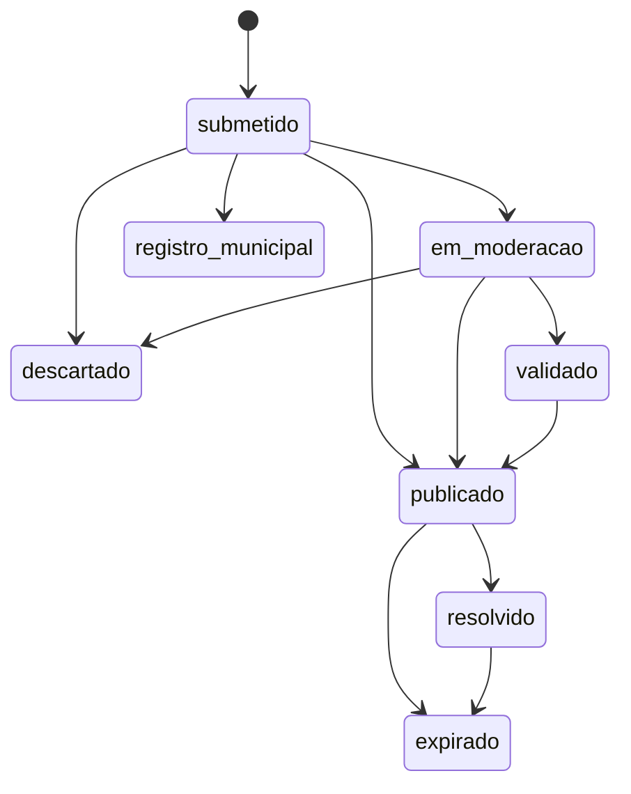

# Matriz de status e visibilidade

Fonte canônica no código: `backend/services/report_catalog.py` (`STATUS_META`).

A UI (legenda, página **Funcionalidades**, catálogo `/api/catalog`) lê os mesmos metadados.

## Regra global

| Condição | Efeito |
|---|---|
| `valid_to` no passado | **Não** aparece em mapa público, mapa gestão nem exportações ativas — independente do status |

## Matriz por status

| Status | Label | Mapa público | Mapa gestão | Export público | Export gestão | Observação |
|---|---|:---:|:---:|:---:|:---:|---|
| `submetido` | Recém-chegado | | ✓ | | ✓ | Pipeline em andamento |
| `em_moderacao` | Precisa da sua análise | | ✓ | | ✓ | Fila do moderador |
| `validado` | Aprovado internamente | | ✓ | | ✓ | Aprovado, ainda não no mapa público |
| `publicado` | Publicado | ✓ | ✓ | ✓ | ✓ | Visível ao cidadão (*se `valid_to` vigente*) |
| `resolvido` | Resolvido | ✓ | ✓ | ✓ | ✓ | Encerrado; permanece visível (*se `valid_to` vigente*) |
| `descartado` | Arquivado | | | | | Só estatísticas e listagens de arquivo |
| `registro_municipal` | Registro municipal | | ✓* | | ✓ | *Camada **municipal** na gestão, não no mapa DER principal |
| `expirado` | Expirado | | | | | Histórico no banco; fora dos feeds ativos |

## Camadas na gestão

| `camada_gestao` | Status | Onde aparece |
|---|---|---|
| `principal` | submetido, em_moderacao, validado, publicado, resolvido | Mapa DER / eventos + manifestações |
| `municipal` | registro_municipal | Camada interna municipal (`/moderation/municipal.geojson`) |

## Uso na API e nos mapas

```python
from backend.services.layer_schema import visibility_flags, feed_visible

publico, gestao = visibility_flags("publicado", valid_to=report.valid_to)
ok_export = feed_visible("publicado", valid_to=report.valid_to, mapa="export_publico")
```

O catálogo expõe a matriz em `status_visibility_matrix` (lista derivada de `STATUS_META`).

## Ciclo de vida resumido



## Documentos relacionados

- [ARQUITETURA_CAMADAS.md](ARQUITETURA_CAMADAS.md) — feeds GeoJSON e flags nas features
- [DATA_MODEL.md](DATA_MODEL.md) — coluna `status` na tabela `reports`
